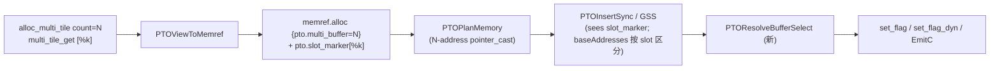

# PTOAS Multi-Buffer 显式表达 + 自动同步 设计

## 1. 文档范围

本文设计 PTOAS 一套新的 multi-buffer 表达方案，覆盖：

- tile_buf 级前端表达；
- multi-buffer 物理地址规划；
- 手动 slot 选择的 lowering；
- 同步与 event id 的自动推导。

本设计参考 PR615 的若干基础设施（多地址 `pto.pointer_cast`、`set_flag_dyn` / `wait_flag_dyn`、`MAX_MULTI_BUFFER_NUM = 16` 等），但 IR 表面、用户接口、同步推导路径都是独立的，不在 PR615 之上叠加。

## 2. 设计目标

1. **显式表达 multi-buffer**：前端在 alloc 处声明"这块逻辑 tile 有 N 个物理槽位"。
2. **手动选择 buffer**：前端在每个使用点（tload / tstore / 计算）显式说"使用第 k 个槽位"，slot 索引可以是常量或任意 SSA 表达式。
3. **自动同步与自动 event id**：跨 slot 的 RAW/WAR/WAW、跨 pipe 同步关系，由 `PTOInsertSync` / `PTOGraphSyncSolver` 自动推导并分配 event id（必要时使用 `set_flag_dyn` / `wait_flag_dyn`）。
4. **不引入"全自动 `iv mod N` 注入"**：要求 multi-buffer 用户显式给 slot 表达式，前端可以把 `arith.remui iv, N` 作为 slot 表达式传进来，但这是前端的责任而非编译器的默认。

## 3. 与 PR615 的关键差异

| 决策点 | PR615 | 本设计 |
|---|---|---|
| Multi-buffer 表达载体 | `tile_buf` 类型字段 `multi_buffer=N` | 独立类型 `!pto.multi_tile_buf<..., count=N>` |
| Slot 选择方式 | 编译器全自动 `iv mod N` | 前端必须显式 `pto.multi_tile_get` |
| 是否依赖 `scf.for` | 必须有 enclosing `scf.for` | 不依赖；unroll、while、跨 block 都支持 |
| 同步推导 | 多地址 `pto.pointer_cast` ⇒ dyn event id（slot key 自动派生） | 每 use 携带 slot 标签 ⇒ 同步按标签推导 |
| CLI 开关 | `--enable-multi-buffer-lowering` | 不需要；slot 选择是 IR 的一部分 |

参考自 PR615：
- `MAX_MULTI_BUFFER_NUM = 16`；
- PlanMemory 给多 buffer alloc 分 N 份地址、emit 多地址 `pto.pointer_cast` 的整体形态；
- `set_flag_dyn` / `wait_flag_dyn` 作 dyn event id 的 codegen；
- inplace 合并取 max。

不沿用 PR615 的部分：
- multi-buffer 不再用 `tile_buf` 的类型字段；
- 没有 `PTOEnableMultiBuffer` 的"`iv mod N` 自动注入"路径；
- 没有 `--enable-multi-buffer-lowering` 开关；
- PlanMemory 的 SPEC_LEVEL_1 复用策略不假设 `iv mod N` 顺序（详见 §5.2）。

## 4. 类型层设计

### 4.1 新增类型 `!pto.multi_tile_buf`

```tablegen
def MultiTileBufType : TypeDef<PTO_Dialect, "MultiTileBuf"> {
  let mnemonic = "multi_tile_buf";
  let summary = "An array of N physical slots sharing one tile_buf shape";
  let parameters = (ins
    "mlir::pto::TileBufType":$slotType,  // 每个槽位的单 tile_buf 类型
    "uint32_t":$count                     // N, 2 <= N <= 16
  );
  let assemblyFormat = "`<` $slotType `,` `count` `=` $count `>`";
}
```

紧凑写法（语法糖，参考 PR615 tile_buf 的 compact 形态）：

```mlir
!pto.multi_tile_buf<vec, 16x16xf16, count=2>
```

完整写法：

```mlir
!pto.multi_tile_buf<!pto.tile_buf<vec, 16x16xf16>, count=2>
```

设计取舍：把 multi-buffer 单独成型，让"单 slot"和"N 槽容器"在类型层一目了然。所有 `tload` / `tstore` / `subview` / 计算 op 继续只见到 `tile_buf`，无需修改 signature。multi-buffer 唯一入口是 `alloc_multi_tile`，唯一出口是 `multi_tile_get`。

### 4.2 新增 op `pto.alloc_multi_tile`

```tablegen
def AllocMultiTileOp : PTO_Op<"alloc_multi_tile", [AttrSizedOperandSegments]> {
  let arguments = (ins
    Optional<Index>:$valid_row,
    Optional<Index>:$valid_col
  );
  let results = (outs MultiTileBufType:$result);
  let hasVerifier = 1;
  let assemblyFormat = [{
    (`valid_row` `=` $valid_row^)? (`valid_col` `=` $valid_col^)?
    attr-dict `:` qualified(type($result))
  }];
}
```

特点：
- **没有** `addr` 操作数 —— multi-buffer 强制由 ptoas 规划物理槽位。
- valid_row / valid_col 沿用 `alloc_tile` 的语义，作用到 N 个 slot 上（所有 slot 共享同一 valid_shape）。

### 4.3 新增 op `pto.multi_tile_get`（手动 slot 选择）

```tablegen
def MultiTileGetOp : PTO_Op<"multi_tile_get", [Pure, ViewLikeOpInterface]> {
  let arguments = (ins
    MultiTileBufType:$source,
    Index:$slot                  // 0 <= slot < count
  );
  let results = (outs TileBufType:$result);
  let hasVerifier = 1;
  let assemblyFormat = [{
    $source `[` $slot `]` attr-dict
    `:` qualified(type($source)) `->` qualified(type($result))
  }];
  let extraClassDeclaration = [{
    ::mlir::Value getViewSource() { return getSource(); }
  }];
}
```

约束：
- 结果 `tile_buf` 必须等于 `source.slotType`（shape / valid_shape / dtype / memSpace / config 全部相同）。
- slot 是常量时，verifier 校验 `0 ≤ slot < count`；动态时不静态校验，由前端保证。
- 结果是普通单槽 `tile_buf`，所有现有 op（subview / set_validshape / tload / 计算）零改动直接使用。

### 4.4 view op 组合规则

| 组合 | 允许？ | 说明 |
|---|---|---|
| `multi_tile_get → subview` | 是 | 推荐：先 pin slot 再切窗口 |
| `multi_tile_get → set_validshape` | 是 | slot 维度与 valid_shape 维度正交 |
| `subview → multi_tile_get` | **否** | subview 操作 `tile_buf`（单槽），multi-buffer 信息已丢失 |
| 嵌套 `multi_tile_get` | **否** | 输入必须是 `multi_tile_buf`，verifier 拦截 |

## 5. Pipeline



**关键顺序变化**：`PTOResolveBufferSelect` 排在 Sync **之后**，让 sync 直接看到 `pto.slot_marker` 并通过 `BaseMemInfo.baseAddresses` 的 slot-narrowing 自动获得 const-slot disjoint 优化。dyn-slot 在 sync 期间走保守路径（保留所有 slot 的 addresses）；Resolve 之后才物化成 `arith.select`。

### 5.1 PTOViewToMemref

- `pto.alloc_multi_tile : !pto.multi_tile_buf<S, count=N>`
   → `memref.alloc {pto.multi_buffer = N : i32}`（类型是 single-slot 物理大小）。
- `pto.multi_tile_get %mb[%k] : ... -> S`
   → 在 memref 层包一层内部 view op：
   ```mlir
   %slot_mem = pto.slot_marker %alloc_mem [%k]
       : memref<16x16xf16, #pto.address_space<vec>> ->
         memref<16x16xf16, #pto.address_space<vec>>
   ```

`pto.slot_marker` 是 ptoas 内部 op（前端不可见），只把 slot SSA 挂到 memref 上，供后续 pass 识别。

### 5.2 PTOPlanMemory

复用 PR615 的多地址规划：
- `pto.multi_buffer = N` 的 alloc 规划 N 份槽位；
- `StorageEntry::multiBufferNum` + `relationOtherBuffers` 持有 sibling slots；
- inplace 合并取 max；
- emit `pto.pointer_cast(addr0, ..., addrN-1)`。

**不沿用** PR615 SPEC_LEVEL_1 "假设 `iv mod N` 顺序"复用策略。本设计允许任意 slot 表达式，复用必须更保守：同一 alloc 的 N 个 slot 必须分配在彼此 disjoint 的物理段，不允许 alias 合并。如未来证明 slot 表达式形如 `iv mod N` 可以放宽，再加单独开关。

### 5.3 新增 pass `PTOResolveBufferSelect`

位置：PlanMemory + Sync 都跑完之后。Sync 期间 `pto.slot_marker` 仍是 IR 节点，被 `MemoryDependentAnalyzer` 识别。Resolve 后下游 EmitC 看到的全部是单 slot 单地址。

逐个 `slot_marker` 处理：

1. **slot 是 `arith.constant c`**：把该 use 链上的 memref 引用改为单地址 `pto.pointer_cast(addr_c)`。
2. **slot 是 SSA**：在 use 点前生成 N-way `arith.select`，索引就是用户的 SSA：
   ```mlir
   %p0 = pto.pointer_cast(%addr0) : memref<...>
   %p1 = pto.pointer_cast(%addr1) : memref<...>
   %is1 = arith.cmpi eq, %k, %c1 : index
   %slot_mem = arith.select %is1, %p1, %p0 : memref<...>
   ```
   **不把 `%k` 替换为 `iv mod N`** —— 完全沿用前端给的表达式。

不变量：本 pass 结束后，每个数据 op 见到的 memref 都是单 slot。多地址 `pto.pointer_cast` 仅作为 sync 分析的"alloc 锚点"保留（已被前置 sync 消费完）。

### 5.4 InsertSync / GraphSyncSolver

#### 5.4.1 BaseMemInfo 的多 slot 表达（已实现）

`PTOIRTranslator::UpdatePointerCastOpMemInfo` 已经支持多地址：

| `pto.pointer_cast` 入参数 | rootBuffer | baseAddresses |
|---|---|---|
| 单地址 `(addr0)` | `addr0` (i64 SSA) | `{0}` |
| 多地址 `(addr0, …, addrN-1)`（全 constant） | `op.getResult()` (cast SSA) | `{addr0, addr1, …, addrN-1}` 解析为 uint64 |
| 多地址，其中有非常量 | `addr0` | `{0}`（保守回退到老路径） |

`UpdateSlotMarkerAliasBufferInfo` 处理 `pto.slot_marker`：

- 常量 slot `k`：把父 BaseMemInfo 的 baseAddresses narrow 到 `{addrK}`。
- 动态 slot：保留父的全部 baseAddresses（保守）。

`MemAlias` 现有的 `isBufferAddressRangeOverlap` 自动获益 ——
- 不同常量 slot ⇒ baseAddresses disjoint ⇒ 无冲突
- 同常量 slot ⇒ baseAddresses 相同 ⇒ 真冲突
- 任一 dyn ⇒ baseAddresses 覆盖所有 slot ⇒ 与任意 slot 都有 overlap，保守同步

#### 5.4.2 完整 SlotInfo（follow-up）

最终目标是显式 `SlotInfo`，让 sync 在动态 slot 路径派发 dyn event id：

```cpp
struct SlotInfo {
  enum Kind { kSingle, kConstSlot, kDynSlot };
  Kind kind;
  uint32_t slotCount;     // == N
  uint32_t constSlot;     // for kConstSlot
  Value   dynSlotExpr;    // for kDynSlot
};
```

冲突判定表：

| Producer | Consumer | 当前实现 | 目标 |
|---|---|---|---|
| Single ↔ Single | – | ✅ 普通同步 | 同 |
| Const(a) ↔ Const(b), a==b | – | ✅ 真冲突，静态 event id | 同 |
| Const(a) ↔ Const(b), a≠b | – | ✅ baseAddresses disjoint，无同步 | 同 |
| Const(a) ↔ Dyn(%k) | – | ⚠️ 保守 alias，全同步 | dyn event id（仅 %k==a 时同步） |
| Dyn(%j) ↔ Dyn(%k), 表达式相同 | – | ⚠️ 保守 alias | 真冲突 + dyn event id |
| Dyn(%j) ↔ Dyn(%k), 可证 disjoint | – | ⚠️ 保守 alias | 同 iter 不冲突，跨 iter dyn event id |
| Dyn ↔ Dyn 不可证 | – | ⚠️ 保守 alias | N 个 dyn event id |

dyn event id 分配 + `set_flag_dyn` / `wait_flag_dyn` 生成留作 follow-up（需要扩展 `SyncEventIdAllocation` 和 `SyncCodegen`）。

资源不足回退（沿 PR615 思路）：N → 偶数 → 2 → 1 → `PIPE_ALL` barrier。

### 5.5 CLI 与构建层级（level3）

不需新开关。`alloc_multi_tile` 存在即驱动 `PTOResolveBufferSelect`。

默认流水（`--pto-level=level1|level2`）由 `PTOPlanMemory` 决定 N 个槽位地址。
`--pto-level=level3` 下本地内存由上层调用方拥有、`PTOPlanMemory` 不运行，故
`alloc_multi_tile` 必须带显式基址 `addr`（与 `alloc_tile` 同规则）：N 个槽位
连续排布为 `[addr, addr + N*slotBytes)`，槽位 k 落在 `addr + k*slotBytes`，其中
`slotBytes = product(shape) * 元素字节数`，上层需自行预留 `N*slotBytes` 字节。
`PTOViewToMemref` 在此情形下直接发射多地址
`pto.pointer_cast(addr, addr+slotBytes, ..., addr+(N-1)*slotBytes)` 锚点（与
PlanMemory 在默认流水产出的形状、槽位顺序一致），其后 sync /
`PTOResolveBufferSelect` 逻辑保持不变。ptoas 在 level3 入口校验：
`alloc_multi_tile` 缺 `addr` 报错；非 level3 带 `addr` 报错。

## 6. 验证规则

`AllocMultiTileOp::verify`：
- `2 ≤ count ≤ 16`；
- valid_row/valid_col 操作数与 slotType 的 valid_shape 一致（沿用 alloc_tile 逻辑）。
- `addr` 为可选 I64 基址；其“level3 必需 / 非 level3 禁止”由 ptoas 入口按层级校验
  （与 `alloc_tile` 一致，不在 verifier 内做层级判断）。带 `addr` 时槽位 shape 与
  元素字节数须为静态，以便确定 `slotBytes`。
- 槽位布局须为 storage-compact：N 个物理槽位按 `product(shape) * 元素字节数` 间隔排布
  （level3 lowering 与 PlanMemory 均如此定尺寸）。`row_plus_one` compact 会把 major
  stride 每行加 1，使槽位物理 strided footprint 超过 `product(shape)`，相邻槽位会静默
  重叠，故 verifier 拒绝 `compact = row_plus_one` 的 slotType。非 `row_plus_one` 的
  compact 布局与 boxed 分形 slayout 为紧密排布（footprint == product(shape)），仍支持。
  （待 slotBytes 改由真实 strided footprint 推导后可放开此限制。）

`MultiTileGetOp::verify`：
- 结果 = `source.slotType`；
- 常量 slot 范围 `[0, count)`；
- 输入必须是 `multi_tile_buf`（防止嵌套 multi_tile_get）。

`PTOViewToMemref` 阶段一致性：
- 来自同一 `alloc_multi_tile` 的所有 use 必须经过 `multi_tile_get`（类型层已保证）。
- function arg / return 不允许出现 `multi_tile_buf`（多 buffer 所有权限定在 ptoas 内）。

## 7. 使用例子（tile_buf 级 IR）

### 7.1 例 1：静态 slot 并行装载与计算

两路 MTE2 装载分别落到 slot 0 / slot 1，向量计算消费两 slot。slot 全部常量。

```mlir
func.func @static_parallel(
    %gm0 : memref<16x16xf16, #pto.address_space<gm>>,
    %gm1 : memref<16x16xf16, #pto.address_space<gm>>) {
  %c0 = arith.constant 0 : index
  %c1 = arith.constant 1 : index

  %mb = pto.alloc_multi_tile
      : !pto.multi_tile_buf<vec, 16x16xf16, count=2>

  %s0 = pto.multi_tile_get %mb[%c0]
      : !pto.multi_tile_buf<vec, 16x16xf16, count=2>
     -> !pto.tile_buf<vec, 16x16xf16>
  %s1 = pto.multi_tile_get %mb[%c1]
      : !pto.multi_tile_buf<vec, 16x16xf16, count=2>
     -> !pto.tile_buf<vec, 16x16xf16>

  pto.tload ins(%gm0 : memref<16x16xf16, #pto.address_space<gm>>)
            outs(%s0  : !pto.tile_buf<vec, 16x16xf16>)
  pto.tload ins(%gm1 : memref<16x16xf16, #pto.address_space<gm>>)
            outs(%s1  : !pto.tile_buf<vec, 16x16xf16>)

  pto.tadd ins(%s0, %s1 : !pto.tile_buf<vec, 16x16xf16>,
                          !pto.tile_buf<vec, 16x16xf16>)
           outs(%s0 : !pto.tile_buf<vec, 16x16xf16>)
  return
}
```

ptoas 自动行为：
- 2 份物理地址 addr0/addr1；
- slot 0 的 MTE2→V 一个静态 event id，slot 1 一个；两 slot 间无 RAW；
- 全部静态 `set_flag` / `wait_flag`，**不产生 dyn flag**。

### 7.2 例 2：双 buffer prefetch（动态 slot）

```mlir
func.func @double_prefetch(
    %gm : memref<?x16x16xf16, #pto.address_space<gm>>, %n : index) {
  %c0 = arith.constant 0 : index
  %c1 = arith.constant 1 : index
  %c2 = arith.constant 2 : index

  %mb = pto.alloc_multi_tile
      : !pto.multi_tile_buf<vec, 16x16xf16, count=2>

  // 预装 iter 0 -> slot0
  %pre = pto.multi_tile_get %mb[%c0]
      : !pto.multi_tile_buf<vec, 16x16xf16, count=2>
     -> !pto.tile_buf<vec, 16x16xf16>
  pto.tload ins(%gm : ...) outs(%pre : !pto.tile_buf<vec, 16x16xf16>)

  scf.for %i = %c0 to %n step %c1 {
    %next     = arith.addi  %i,    %c1 : index
    %cur_idx  = arith.remui %i,    %c2 : index
    %next_idx = arith.remui %next, %c2 : index

    // prefetch 到另一 slot —— slot 索引由前端控制
    %s_next = pto.multi_tile_get %mb[%next_idx]
        : !pto.multi_tile_buf<vec, 16x16xf16, count=2>
       -> !pto.tile_buf<vec, 16x16xf16>
    pto.tload ins(%gm : ...) outs(%s_next : !pto.tile_buf<vec, 16x16xf16>)

    %s_cur = pto.multi_tile_get %mb[%cur_idx]
        : !pto.multi_tile_buf<vec, 16x16xf16, count=2>
       -> !pto.tile_buf<vec, 16x16xf16>
    pto.tadd ins(%s_cur, %s_cur : ..., ...) outs(...)
  }
  return
}
```

ptoas 自动行为：
- `PTOResolveBufferSelect` 直接用 `%cur_idx` / `%next_idx` 作 `arith.select` 索引；
- 同步分析：producer slot 表达式 `(iv+1)%2`，consumer slot `iv%2` → 同 iter disjoint / 跨 iter 冲突 → 2 个 dyn event id；
- emit `set_flag_dyn` / `wait_flag_dyn`，event id value 与 slot 表达式同源。

### 7.3 例 3：N=4 同表达式轮转

```mlir
%mb = pto.alloc_multi_tile
    : !pto.multi_tile_buf<vec, 32x32xf32, count=4>
%c4 = arith.constant 4 : index

scf.for %i = %c0 to %n step %c1 {
  %k = arith.remui %i, %c4 : index
  %slot = pto.multi_tile_get %mb[%k]
      : !pto.multi_tile_buf<vec, 32x32xf32, count=4>
     -> !pto.tile_buf<vec, 32x32xf32>

  pto.tload ins(%gm : ...) outs(%slot : !pto.tile_buf<vec, 32x32xf32>)
  pto.tadd  ins(%slot, %other : ..., ...) outs(...)
}
```

ptoas 自动行为：
- 4 份物理地址；
- producer/consumer 同 slot 表达式 → 同 slot 内 RAW；跨 iter 通过 4 个 dyn event id 推进。

### 7.4 例 4：无 `scf.for` 的手动 unroll

```mlir
%mb = pto.alloc_multi_tile
    : !pto.multi_tile_buf<vec, 16x16xf16, count=2>
%c0 = arith.constant 0 : index
%c1 = arith.constant 1 : index

%s0 = pto.multi_tile_get %mb[%c0]
    : !pto.multi_tile_buf<vec, 16x16xf16, count=2>
   -> !pto.tile_buf<vec, 16x16xf16>
pto.tload ins(%gm0 : ...) outs(%s0 : !pto.tile_buf<vec, 16x16xf16>)

%s1 = pto.multi_tile_get %mb[%c1]
    : !pto.multi_tile_buf<vec, 16x16xf16, count=2>
   -> !pto.tile_buf<vec, 16x16xf16>
pto.tload ins(%gm1 : ...) outs(%s1 : !pto.tile_buf<vec, 16x16xf16>)

pto.tadd ins(%s0, %s0 : ..., ...) outs(...)
pto.tadd ins(%s1, %s1 : ..., ...) outs(...)
```

无循环也能 multi-buffer：两个常量 slot 的 producer/consumer 各自独立同步。这是 PR615 自动路径原生不支持的形态。

### 7.5 例 5：与 subview 组合

```mlir
%mb = pto.alloc_multi_tile
    : !pto.multi_tile_buf<vec, 32x32xf16, count=2>

scf.for %i = ... {
  %k = arith.remui %i, %c2 : index
  %slot = pto.multi_tile_get %mb[%k]
      : !pto.multi_tile_buf<vec, 32x32xf16, count=2>
     -> !pto.tile_buf<vec, 32x32xf16>
  %win = pto.subview %slot[%c0, %c0] sizes=[16, 16]
      : !pto.tile_buf<vec, 32x32xf16>
     -> !pto.tile_buf<vec, 16x16xf16>
  pto.tload ins(%gm : ...) outs(%win : !pto.tile_buf<vec, 16x16xf16>)
  pto.tadd  ins(%win, %win : ..., ...) outs(...)
}
```

slot 标签在 `%slot` 上 pinned，`subview` 在 memref 层继承 `slot_marker`，sync 分析照常工作。

## 8. 测试覆盖

| 测试 | 覆盖点 |
|---|---|
| `multi_tile_buf_type_verify.pto` | count 越界、slot 越界、嵌套 multi_tile_get 报错 |
| `alloc_multi_tile_view_to_memref.pto` | 类型 → `memref.alloc {pto.multi_buffer=N}` |
| `multi_tile_get_const_slot_resolve.pto` | 例 1：常量 slot → 单地址 pointer_cast |
| `multi_tile_get_dyn_slot_resolve.pto` | 例 2：动态 slot → dyn select 链 |
| `multi_tile_prefetch_insert_sync.pto` | 例 2：InsertSync 推导 prefetch 双 event id dyn flag |
| `multi_tile_prefetch_gss.pto` | 同上，GraphSyncSolver 路径 |
| `multi_tile_n4_rotate.pto` | 例 3：N=4 同表达式轮转 |
| `multi_tile_no_loop_unroll.pto` | 例 4：无 scf.for 的手动 unroll |
| `multi_tile_subview_compose.pto` | 例 5：与 subview 组合 |
| `multi_tile_disjoint_const_slots.pto` | 例 1：两个常量 slot 无冲突，不发同步 |

建议验证命令：

```bash
lit test/lit/pto/multi_tile_buf_type_verify.pto
lit test/lit/pto/alloc_multi_tile_view_to_memref.pto
lit test/lit/pto/multi_tile_get_const_slot_resolve.pto
lit test/lit/pto/multi_tile_get_dyn_slot_resolve.pto
lit test/lit/pto/multi_tile_prefetch_insert_sync.pto
lit test/lit/pto/multi_tile_prefetch_gss.pto
```

## 9. 当前实现状态 & 后续

### 已实现（截至本批次）

| 阶段 | 状态 | 文件 |
|---|---|---|
| `!pto.multi_tile_buf<S, count=N>` 类型，N ∈ [2, 16] | ✅ | `include/PTO/IR/PTOTypeDefs.td`, `lib/PTO/IR/PTOTypeDefs.cpp` |
| `pto.alloc_multi_tile` / `pto.multi_tile_get` / `pto.slot_marker` op | ✅ | `include/PTO/IR/PTOOps.td`, `lib/PTO/IR/PTO.cpp` |
| 类型 / op 验证（count 范围、slot 范围、嵌套禁止） | ✅ | `lib/PTO/IR/PTOTypeDefs.cpp`, `lib/PTO/IR/PTO.cpp` |
| `PTOViewToMemref` 下沉 alloc_multi_tile/multi_tile_get → `memref.alloc {pto.multi_buffer=N}` + `pto.slot_marker` | ✅ | `lib/PTO/Transforms/PTOViewToMemref.cpp` |
| `PTOPlanMemory` N-way 多 slot 规划：`StorageEntry.relationOtherBuffers` 列表 + `ExpandMultiBufferStorageEntry` N-way 兄弟展开 + `UpdateBuffer2Offsets` 按 slot 顺序写回 | ✅ N ∈ [2, 16] | `lib/PTO/Transforms/PTOPlanMemory.cpp`, `lib/PTO/Transforms/PTOPlanMemory.h` |
| `AllocToPointerCast` emit N-address `pto.pointer_cast(addr0..addrN-1)` | ✅ | `lib/PTO/Transforms/AllocToPointerCast.cpp` (pre-existing 已支持) |
| `PTOResolveBufferSelect` pass（常量 slot → 单地址 cast、动态 slot → arith.select 链） | ✅ | `lib/PTO/Transforms/PTOResolveBufferSelect.cpp` |
| ptoas pipeline 接入（PlanMemory → ResolveBufferSelect → Sync） | ✅ | `tools/ptoas/ptoas.cpp` |
| **Pipeline 重排**：Sync 跑在 `PTOResolveBufferSelect` 之前 → sync 直接看 `pto.slot_marker` | ✅ | `tools/ptoas/ptoas.cpp` |
| **InsertSync 多 slot 感知**：`UpdatePointerCastOpMemInfo` 多地址 cast 把 N 个 slot 的物理 offset 灌进 `baseAddresses`；`UpdateSlotMarkerAliasBufferInfo` 按 slot 常/动态 narrowing | ✅ | `lib/PTO/Transforms/InsertSync/PTOIRTranslator.cpp` |
| **`MemAlias` 自动识别 const-slot disjoint**：不同常量 slot 的 access baseAddresses disjoint → 不发同步 | ✅ | `lib/PTO/Transforms/InsertSync/MemoryDependentAnalyzer.cpp` (复用既有 range-overlap 逻辑) |
| **GSS 别名链穿透 `pto.bind_tile` / `pto.slot_marker`** | ✅ | `lib/PTO/Transforms/Utils.cpp` (`getOperationAliasInfo`) |
| **InsertSync 处理 arith.select-on-memref**：保留为防御逻辑（Resolve 移到 sync 后实际不再产生此场景） | ✅ | `lib/PTO/Transforms/InsertSync/PTOIRTranslator.cpp` |
| **`GetEventIdNum` 按多 slot 推 N**：back-edge dep 双侧 `baseAddresses.size() == N` 时返回 N | ✅ | `lib/PTO/Transforms/InsertSync/InsertSyncAnalysis.cpp` |
| **`SyncOperation` 携带 slot SSA**：`slotSSAExpr` + `slotCount` 字段，set/wait 各自记录自己一侧的 slot SSA | ✅ | `include/PTO/Transforms/InsertSync/SyncCommon.h`, `lib/PTO/Transforms/InsertSync/{SyncCommon,InsertSyncAnalysis}.cpp` |
| **dyn event-id codegen**：`CreateSetWaitOpForMultiBuffer` 发 `pto.set_flag_dyn` / `pto.wait_flag_dyn`，event id 由 N-way `arith.select` 链根据 `slot % N` 选自分配的 N 个静态 event id | ✅ | `lib/PTO/Transforms/InsertSync/SyncCodegen.cpp` |
| **`SyncEventIdAllocation` N event ids 分配**：复用既有 `eventIdNum > 1` 路径（已支持 N），自动给 set/wait 对分配 N 个 hardware event id | ✅ pre-existing | `lib/PTO/Transforms/InsertSync/SyncEventIdAllocation.cpp` |
| **GSS slot-aware**：`SyncSolverIRTranslator::tracebackMemValsStep` 在 `pto.slot_marker` 停步；`MemInfo::getMemInfoForSlotMarker` 按常量 slot 收窄 `PointerLikeInfo::addresses`、按 slot_marker enclosing loop 设 `parentLoop`，让 `getMultiBufferEventIdInfo` 识别多 buffer 并分配 N event ids | ✅ | `lib/PTO/Transforms/GraphSyncSolver/{SyncSolverIRTranslator,MemInfo}.cpp` |
| **GSS slotSSAExpr 落到 SetWaitOp**：`findSlotSSAExprForRWOp` 沿 `bind_tile` 走回 `pto.slot_marker.slot`，set 端取 `op1` 的 slot SSA、wait 端取 `op2` 的 | ✅ | `include/PTO/Transforms/GraphSyncSolver/SyncSolverIR.h`, `lib/PTO/Transforms/GraphSyncSolver/SyncSolver.cpp` |
| **GSS dyn flag codegen**：`SyncSolverCodeGen::emitSyncOp` 在 `eventIds.size() > 1 && slotSSAExpr` 时折成单条 `pto.set_flag_dyn` / `pto.wait_flag_dyn`，event_id 用 N-way `arith.select` 链按 `slot % N` 选；`allAtOnce` prime/drain 仍走 N 静态 fanout（语义需要每个 slot 各 prime / drain 一次） | ✅ | `lib/PTO/Transforms/GraphSyncSolver/SyncSolverCodeGen.cpp` |
| **共享 affine slot 分析 `SlotAffineAnalysis`**：`findSlotMarkerExpr` + `compareSlotSSA` 三态（kEqual / kDisjoint / kUnknown），覆盖 `iv % N`、`(iv ± c) % N`、纯常量、相同 SSA 等形态；InsertSync / GSS / EmitC 三处共用 | ✅ | `include/PTO/Transforms/SlotAffineAnalysis.h`, `lib/PTO/Transforms/SlotAffineAnalysis.cpp` |
| **InsertSync 同 iter forward 提前 drop**：`MemAnalyze` 在 forward dep 上 跑 `isForwardDepDroppableBySlotAffine`，affine 可证 disjoint 的 pair 整对剔除，loop 体内省一对 same-iter set/wait | ✅ | `lib/PTO/Transforms/InsertSync/InsertSyncAnalysis.cpp` |
| **GSS 同 iter forward 提前 drop**：`checkMemoryConflictsForOcc` 在非 back-edge 路径上同样基于 affine disjoint 把整组 (corePipeSrc, corePipeDst) 过滤掉 | ✅ | `lib/PTO/Transforms/GraphSyncSolver/SyncSolver.cpp` |
| **GSS 同 SSA 行为对齐 InsertSync**：`getMultiBufferEventIdInfo` 不再因 all-equal slot SSA 早退，对同 SSA 的 producer/consumer 也走 N dyn event id 路径；GSS 同 SSA 现在 emit 与 InsertSync 完全一样的 prefetch pipeline | ✅ | `lib/PTO/Transforms/GraphSyncSolver/SyncSolver.cpp` |
| **EmitC 穿透 `arith.select`-on-memref**：`PTOMaterializeTileHandles::computeExplicitAddress` 沿 select 两支递归求 i64 地址，配合 dyn slot 路径的 select 链；EmitC TASSIGN 拿到正确地址 | ✅ | `lib/PTO/Transforms/PTOMaterializeTileHandles.cpp` |
| **`multi_tile_get` lowering 防御**：`op->getOperand(0)` 取 source（绕开类型 cast），因为 alloc_multi_tile replace 之后 source 已经变成 memref，typed accessor `getSource()` 会断言 | ✅ | `lib/PTO/Transforms/PTOViewToMemref.cpp` |
| lit 测试（17 个）：parse/print、verifier、const slot lowering、dyn slot lowering、N=3 / N=4 端到端、无 loop unroll、const-slot sync disjoint、dyn-slot sync 编译、GSS multi-buffer compile、prefetch dyn event-id (InsertSync)、prefetch GSS dyn flag、affine disjoint slots、const preload + dyn loop select、preload + loop set/wait、unknown slot GSS 保守降级 | ✅ | `test/lit/pto/multi_tile_*.pto` |

### 当前限制

- **affine 分析仅覆盖核心几种形态**：`compareSlotSSA` 当前能证 `iv % N` / `(iv ± c) % N` / 同 SSA / 纯常量；不能证 `(iv * c) % N`、跨函数 / 跨循环的 SSA 等价、非 `arith.remui` 包装的 slot 表达式。命中不到时退回 kUnknown / 保守 N dyn event id。
- **PlanMemory N>2 不复用 Stage1**：N>2 的兄弟 slot 不走 SPEC_LEVEL_1 "ping/pong 相邻摆放"优化，用更多内存。N=2 路径不变。
- 初版仅支持 `loc=vec` / `loc=mat` local memory。
- function argument / return 上的 `multi_tile_buf` 不支持（多 buffer 所有权限定在 ptoas 内）。
- workspace / preload / CV 多 buffer 不在本设计范围。

### 后续 PR

1. **affine 分析扩展**：加 `(iv * c) % N`、跨 loop iter_arg 的 SSA 等价、非 `arith.remui` 形态（`arith.divui` / affine.apply）。
2. **PlanMemory N > 2 SPEC_LEVEL_1 复用**：扩展 ping/pong 相邻摆放为 N-way 相邻摆放，减少 N > 2 的物理内存压力。
3. **Python 绑定 + samples**：暴露 `alloc_multi_tile` / `multi_tile_get`，配套 `test/samples` 的 prefetch 示例。
4. **跨函数 ABI**：把 `multi_tile_buf` 支持成 func arg / return，配套 sync 跨函数传递（v2 议题）。
